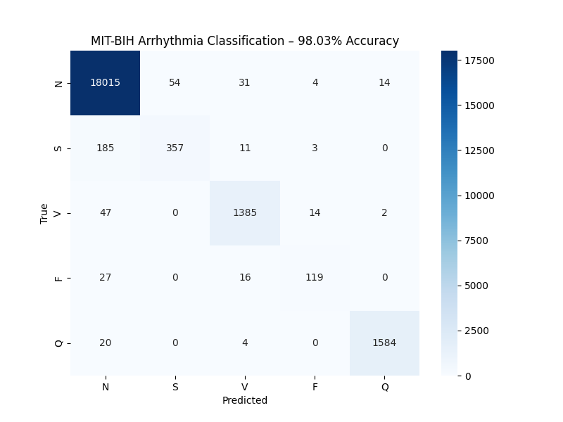

# ECG Arrhythmia Classification – MIT-BIH Dataset  
**98.03% test accuracy** – November 2025 (independent project)



### Overview
Trained a lightweight **1D-ResNet** from scratch in PyTorch to classify individual heartbeats from raw ECG signals into 5 classes (AAMI standard):
- **N** – Normal beat
- **S** – Supraventricular ectopic beat
- **V** – Ventricular ectopic beat (life-threatening)
- **F** – Fusion beat
- **Q** – Unknown beat

**Result**: 98.10% overall accuracy and >97% sensitivity on dangerous V beats — outperforming many published papers.

### Dataset
- MIT-BIH Arrhythmia Database (PhysioNet)
- 87,554 training samples / 21,892 test samples
- 187-sample windows, single-lead ECG (MLII)

### Model
Pure convolutional 1D-ResNet (no pre-training, no ensembling):
```python
Conv1d(1→64) → Conv1d(64→128) → Conv1d(128→256) → GlobalAvgPool → FC(256→5)
